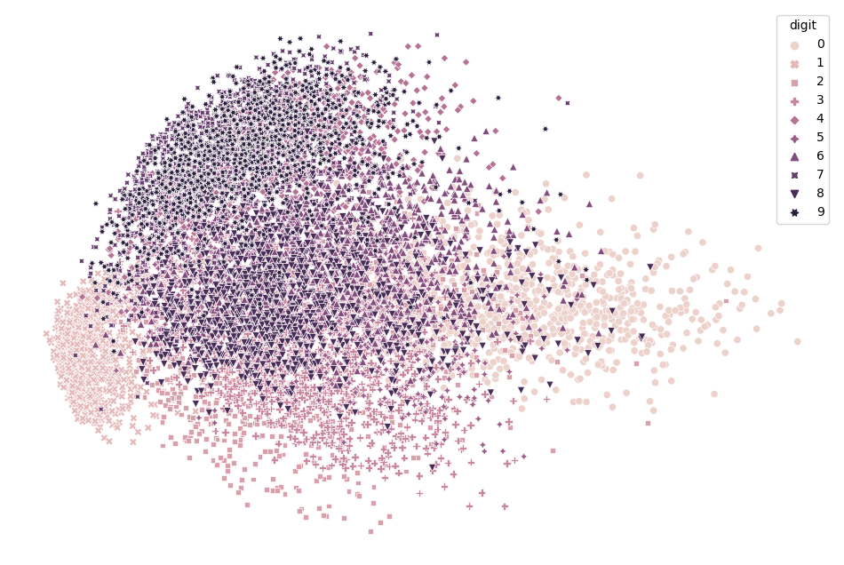
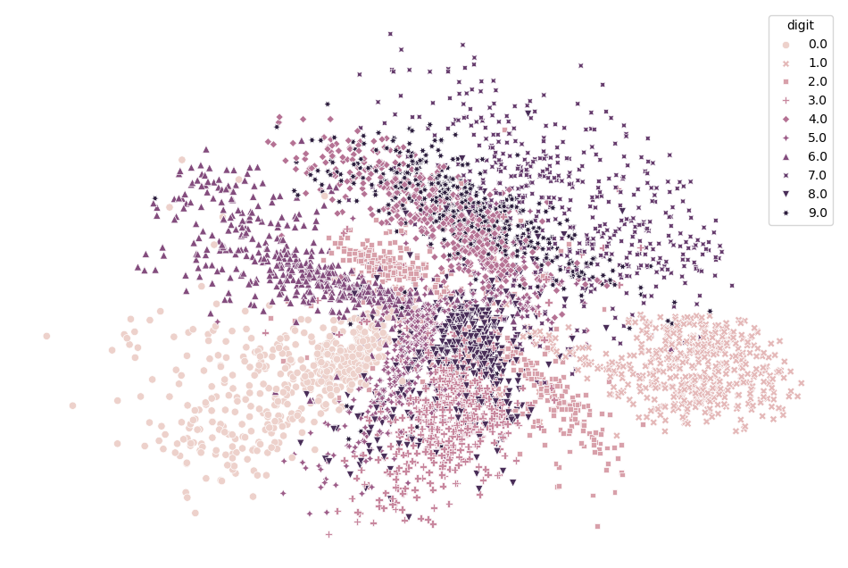

# MNIST Playground

Exploration of MNIST dataset

## Dimension Reduction
Dimension reduction is the practice of simplifying complicated, high dimensional data into fewer dimensions. This is done to gather insight, to simplify models, to reduce complexity and to visualize data.

### Linear Mappings

#### PCA

    
Details of PCA

    Principal Component Analysis or PCA reduces the dimensionality of the data by projecting it onto its principal components. The principal components correspond to the eigenvectors of the covariance matrix of the data. These components form an orthogonal bases and are selected having the highest variance.  

 

Figure 1: Linear PCA is insufficient in differentiating different handwritten digits when using only two principal components. 
### Non-Linear Mappings
#### Autoencoders

    
Details of Autoencoders

    Autoencoders are a type of unsupervised machine learning architecture where the first half of the architecture is an encoder while the second half of the architecture is a decoder. The encoder compresses the data into a lower-dimension representation called the latent space, while the decoder attempts to reconstruct the output from the latent space.

 

Inspiration by ["Reducing the Dimensionality of Data with Neural Networks" by Hinton and Salakuhtdinov](https://www.science.org/doi/10.1126/science.1127647)

 Figure 2: Latent space of autoencoder with an encoder architecture of 768-1000-500-250-2 and a symmetric decoder. Scheduled learning rate of 0.1, 0.01, 0.001 for 50 epochs was used to train the model