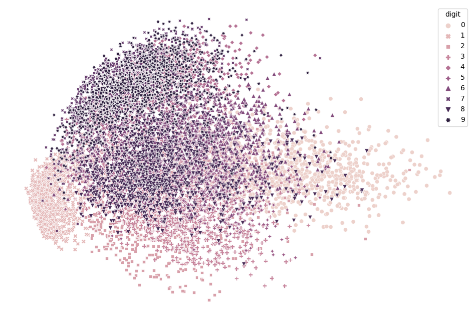
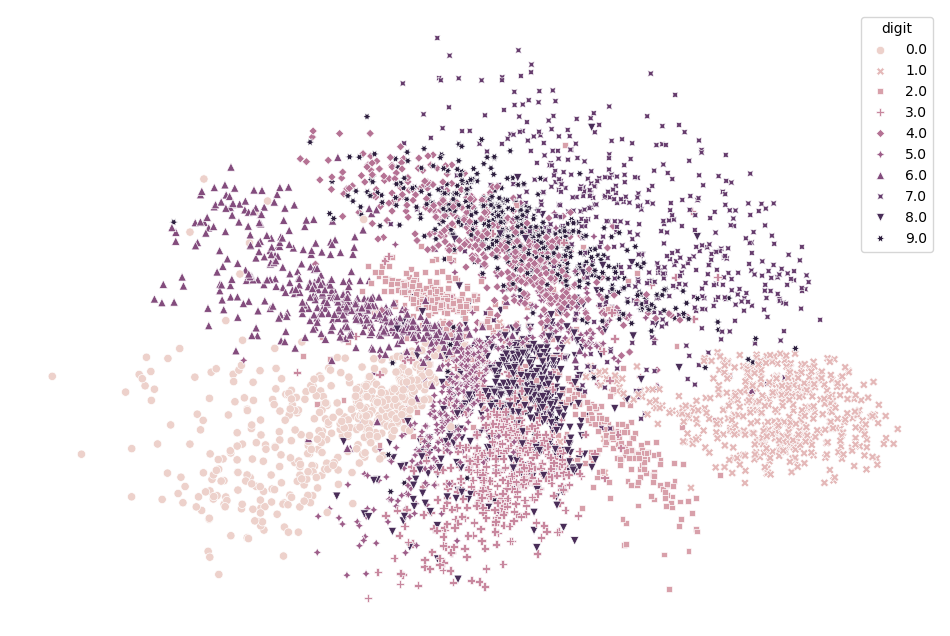

# MNIST Playground

Exploration of MNIST dataset

## Dimension Reduction
Dimension reduction is the practice of projecting complicated, high dimensional data into fewer dimensions. This is done to gather insight, simplify models, reduce complexity and visualize data.

### Linear Mappings

#### PCA

Principal Component Analysis or PCA reduces the dimensionality of data by projecting it onto its principal components. These principal components correspond to the eigenvectors of the correlation matrix of the data. The correlation matrix is a positive semidefinite matrix, hence the eigenvectors form an orthogonal basis that captures non-redundant information between principal components.

Figure 1: Linear PCA is insufficient in differentiating different handwritten digits when using only two principal components. 

### Non-Linear Mappings

#### Autoencoders

Autoencoders are a type of unsupervised machine learning architecture where the former half of the architecture is an encoder that encodes an input into a more economic representation. While the latter half of the architecture is a decoder that attempts to reconstruct the input given the encoded representation. A form of dimension reduction takes place where the encoder compresses the input into the latent space (low dimensional representation), while the decoder attempts to reconstruct the output from the latent space.

Inspiration by ["Reducing the Dimensionality of Data with Neural Networks" by Hinton and Salakuhtdinov](https://www.science.org/doi/10.1126/science.1127647)

 Figure 2: Latent space of autoencoder with an encoder architecture of 768-1000-500-250-2 and a symmetric decoder. Scheduled learning rate of 0.1, 0.01, 0.001 for 50 epochs was used to train the model.